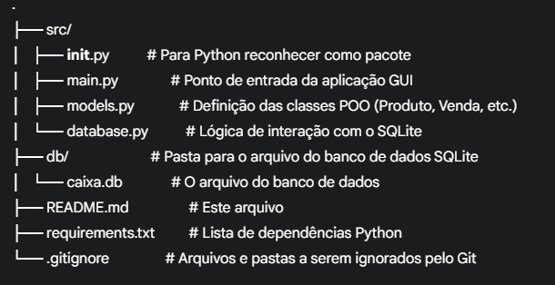
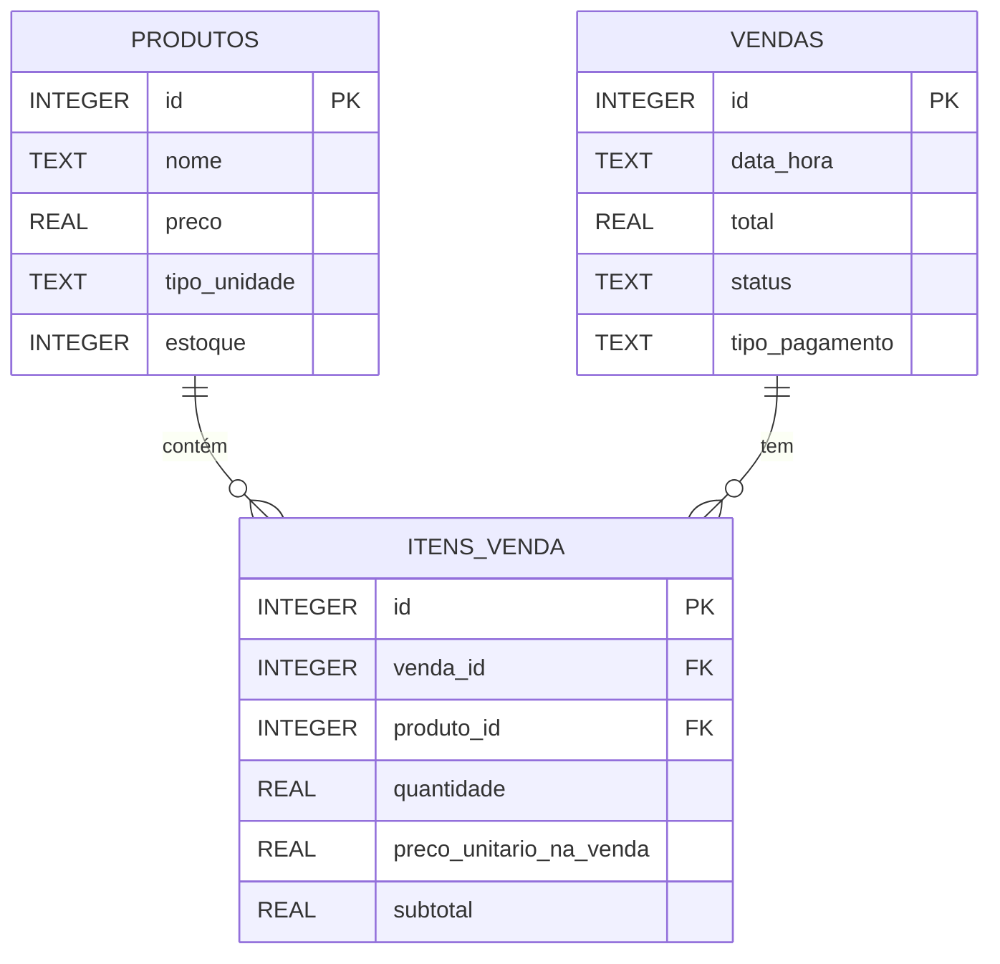

# Sistema de Caixa (Protótipo - Revisão POO)

Um protótipo de sistema de caixa/PDV (Ponto de Venda) desenvolvido em Python puro (sem frameworks), com interface gráfica local (Tkinter) e banco de dados SQLite. O objetivo principal deste projeto é aprofundar os conceitos de Programação Orientada a Objetos (POO), entender a interação direta com bancos de dados e explorar a construção de interfaces de usuário básicas, servindo como um "aquecimento" prático antes de projetos mais complexos.

## 1. Tecnologias Utilizadas

* **Linguagem de Programação:** Python (versão 3.9+)
* **Interface Gráfica (GUI):** Tkinter (biblioteca padrão do Python)
* **Banco de Dados:** SQLite (banco de dados local embutido no Python)
* **Controle de Versão:** Git / GitHub

## 2. Estrutura do Projeto (Inicial)


## 3. Como Executar o Projeto

### Pré-requisitos
* Python 3.x instalado (recomenda-se 3.9 ou superior).
* Git instalado.

### Instalação e Setup
```bash
# 1. Clone o repositório
git clone [https://github.com/thiagoStella/sistema-de-caixa.git](https://github.com/thiagoStella/sistema-de-caixa.git)
cd sistema-de-caixa

# 2. Crie e ative um ambiente virtual (boa prática!)
python -m venv venv
# No Windows:
.\venv\Scripts\activate
# No macOS/Linux:
source venv/bin/activate

# 3. Instale as dependências (inicialmente poucas, mas é bom ter o arquivo)
pip install -r requirements.txt

# 4. Rode a aplicação (assumindo que o ponto de entrada é src/main.py)
python src/main.py
```

## 4. User Stories

### User Stories do OPERADOR (O núcleo da funcionalidade do sistema de caixa)
- Como um Operador, eu quero adicionar produtos à venda digitando seu código ou nome, para registrar itens rapidamente.

- Como um Operador, eu quero adicionar produtos por quantidade (unidades) ou por peso (kg), para vender diferentes tipos de itens (ex: frutas vs. pães).

- Como um Operador, eu quero visualizar a lista de itens na venda em andamento, para conferir o pedido antes de finalizar.

- Como um Operador, eu quero ver o subtotal e o total da venda em tempo real, para informar o cliente e processar o pagamento corretamente.

- Como um Operador, eu quero remover um item da venda, caso o cliente mude de ideia ou haja um erro.

- Como um Operador, eu quero aplicar descontos a itens ou à venda total, para gerenciar promoções ou ajustes de preço.

- Como um Operador, eu quero registrar diferentes tipos de pagamento (dinheiro, cartão de crédito, débito), para atender às preferências do cliente.

- Como um Operador, eu quero calcular o troco automaticamente para pagamentos em dinheiro, para agilizar o atendimento.

- Como um Operador, eu quero finalizar a venda, para registrar a transação e liberar o caixa.

- Como um Operador, eu quero visualizar as últimas vendas realizadas, para referência rápida ou para reimprimir um recibo.

- Como um Operador, eu quero reimprimir o recibo de uma venda, caso o cliente solicite.

### User Stories do DONO (Funcionalidades Administrativas na aba protegida)
- Como um Dono, eu quero acessar uma aba administrativa protegida por senha, para gerenciar o sistema de forma segura.

- Como um Dono, eu quero adicionar novos produtos (nome, preço, tipo: unidade/kg), para manter o catálogo atualizado.

- Como um Dono, eu quero editar informações de produtos existentes (nome, preço), para corrigir erros ou atualizar valores.

- Como um Dono, eu quero remover produtos do sistema, caso não sejam mais vendidos.

- Como um Dono, eu quero visualizar o estoque atual de todos os produtos, para saber o que precisa ser reposto.

- Como um Dono, eu quero ajustar o estoque de um produto manualmente, para registrar reposições ou perdas.

- Como um Dono, eu quero visualizar um resumo das vendas diárias (total de vendas, itens mais vendidos), para acompanhar o desempenho do negócio.

- Como um Dono, eu quero visualizar o histórico completo de vendas, para análises mais detalhadas.

### User Stories do CLIENTE (Foco na UX na interação com a interface do Operador)
- Como um Cliente, eu gostaria de ver claramente os preços dos produtos por unidade ou por quilo, para entender o custo do que estou comprando.

- Como um Cliente, eu gostaria de ver um resumo claro do meu pedido na tela, para confirmar os itens e o total antes de pagar.

- Como um Cliente, eu gostaria de ter opções de pagamento visíveis e fáceis de escolher, para finalizar a compra rapidamente.

- Como um Cliente, eu gostaria de receber um recibo físico ou digital da minha compra, para ter um comprovante.


## 5. Esquema do Banco de Dados (SQLite)
O sistema de caixa utiliza um banco de dados SQLite para persistência dos dados. Abaixo, o esquema das tabelas principais:


#### **Tabela: `Produtos`**

| Coluna         | Tipo    | Restrições              | Descrição                                  |
| :------------- | :------ | :---------------------- | :----------------------------------------- |
| `id`           | INTEGER | PRIMARY KEY AUTOINCREMENT | Identificador único do produto             |
| `nome`         | TEXT    | NOT NULL                | Nome do produto (ex: "Maçã", "Pão")        |
| `preco`        | REAL    | NOT NULL                | Preço unitário ou por kg (ex: 5.50)        |
| `tipo_unidade` | TEXT    | NOT NULL                | Tipo de unidade: "UNIDADE" ou "KG"         |
| `estoque`      | INTEGER | NOT NULL                | Quantidade em estoque (para controle básico) |

#### **Tabela: `Vendas`**

| Coluna          | Tipo    | Restrições              | Descrição                                 |
| :-------------- | :------ | :---------------------- | :---------------------------------------- |
| `id`            | INTEGER | PRIMARY KEY AUTOINCREMENT | Identificador único da venda              |
| `data_hora`     | TEXT    | NOT NULL                | Data e hora da venda (YYYY-MM-DD HH:MM:SS) |
| `total`         | REAL    | NOT NULL                | Valor total da venda                      |
| `status`        | TEXT    | NOT NULL                | Status da venda (FINALIZADA, CANCELADA)   |
| `tipo_pagamento`| TEXT    |                         | Forma de pagamento (DINHEIRO, CARTAO, PIX) |

#### **Tabela: `Itens_Venda`**

| Coluna                    | Tipo    | Restrições              | Descrição                                           |
| :------------------------ | :------ | :---------------------- | :-------------------------------------------------- |
| `id`                      | INTEGER | PRIMARY KEY AUTOINCREMENT | Identificador único do item da venda                |
| `venda_id`                | INTEGER | NOT NULL                | ID da venda à qual este item pertence               |
| `produto_id`              | INTEGER | NOT NULL                | ID do produto vendido                               |
| `quantidade`              | REAL    | NOT NULL                | Quantidade do produto vendido (pode ser float para kg) |
| `preco_unitario_na_venda` | REAL    | NOT NULL                | Preço do produto no momento da venda (histórico)    |
| `subtotal`                | REAL    | NOT NULL                | Subtotal do item (`quantidade * preco_unitario_na_venda`) |





## 6. Gerenciamento do Projeto e Estimativas
Este projeto está sendo desenvolvido em Sprints diários com foco de 1 hora.

### 6.1. Nível Atual do Desenvolvedor
Avaliação: Iniciante Profissional / Júnior Aspirante com Forte Potencial de Crescimento.

Pontos Fortes: Proatividade, curiosidade, pensamento estratégico, perseverança, autoconsciência, pragmatismo e base em lógica de programação.

### 6.2. Estimativa de Sprints (Fases)
#### Fase	Descrição	Sprints Estimados (1h/Sprint)
- Fase 1: Fundação e Planejamento	Consolidação do Setup e Documentação
- Fase 2: Backend (Lógica Pura + SQLite)	Modelos POO, Repositórios, Lógica de Negócio
- Fase 3: Interfaces (Tkinter)	Interface do Operador e Dono
### Total Estimado (Protótipo Inicial)	~44 horas	44 Sprints


### 6.3. Custos Hipotéticos (Valor da Mão de Obra)
Se este projeto fosse desenvolvido por um desenvolvedor júnior (considerando R25−R45/hora no mercado brasileiro), o custo estimado da mão de obra para este protótipo local seria de R$ 1.500 a R$ 4.050.

### 6.4. Acompanhamento das Sprints (Checklist)

Este checklist será atualizado a cada commit para refletir o progresso das sprints.

#### **Fase 1: Fundação e Planejamento (1 Sprint)**
- [x] **Sprint 1:** Revisar e consolidar `README.md` com o esquema DB e adicionar esta seção de gerenciamento.

#### **Fase 2: Construção do Backend (Lógica Pura Python + SQLite) (27 Sprints)**
##### 2.1. Implementação do Core (Classes POO e Conexão DB):
- [x] **Sprint 2-4:** `src/database.py` - Conexão SQLite e funções para criar tabelas (`CREATE TABLE`).
- [ ] **Sprint 5-7:** `src/models.py` - Definição das classes POO (`Produto`, `Venda`, `ItemVenda`).
- [ ] **Sprint 8-11:** `src/repository.py` - Criação da camada de acesso a dados (`save`, `get`, `all`).
- [ ] **Sprint 12:** Testes iniciais no console para `ProdutoRepository`.
##### 2.2. Lógica Refatorada do Operador (Core do Sistema de Caixa):
- [ ] **Sprint 13-15:** Refatorar a função `registrar_produto()` para usar a classe `Produto` e `ProdutoRepository`.
- [ ] **Sprint 16-18:** Refatorar `remover_produto()` para usar a classe `Produto` e `ProdutoRepository`.
- [ ] **Sprint 19-21:** Refatorar `mostrar_parcial()` e `finalizar_compra()` para interagir com `Venda` e `ItemVenda`.
- [ ] **Sprint 22-23:** Integrar o loop principal (`main`) com as novas funções POO/DB.
##### 2.3. Lógica Refatorada do Dono (Gerenciamento Básico):
- [ ] **Sprint 24-25:** Implementar a lógica da senha para a aba administrativa.
- [ ] **Sprint 26-28:** Implementar a lógica de gerenciamento de produtos (adicionar/editar/remover) via terminal.

#### **Fase 3: Construção das Interfaces (Frontend - Tkinter) (16 Sprints)**
##### 3.1. Interface do Operador (Tela Principal de Venda):
- [ ] **Sprint 29-31:** Setup básico do Tkinter, criação da janela principal e layout da tela de venda.
- [ ] **Sprint 32-35:** Integrar os botões para adicionar/remover produtos, exibir no Tkinter.
- [ ] **Sprint 36-38:** Implementar a tela de pagamento e finalização da venda no Tkinter.
##### 3.2. Interface do Dono (Aba Administrativa):
- [ ] **Sprint 39-41:** Layout da aba administrativa, proteção por senha e navegação.
- [ ] **Sprint 42-44:** Formulários Tkinter para adicionar/editar produtos, listagem de produtos.

## 7. Contato / Autor
### Desenvolvido por: Thiago Stella Pontes

[\[GitHub\]](https://github.com/thiagoStella)